# 👨🏻‍💻 Caio Fabricio

**`Backend Developer`**

Hi, I'm Caio Fabricio, a Backend Developer from Brazil.

I have a degree in **Analysis and Systems Development (ADS)** and professional experience developing **REST APIs, system integrations and backend services**.

I have worked with **Java (Spring Boot)** and **PHP (Laravel)** building scalable backend systems, database modeling and integrations with external platforms.

My experience also includes developing **microservices, automation processes and cloud integrations using AWS S3**.

I enjoy building systems that solve real problems and improve business processes through automation and integration.

---

# 👨🏻‍💻 Caio Fabricio

**`Desenvolvedor Backend`**

Me chamo Caio Fabricio e sou desenvolvedor backend no Brasil.

Sou formado em **Análise e Desenvolvimento de Sistemas (ADS)** e possuo experiência profissional desenvolvendo **APIs REST, integrações entre sistemas e serviços backend**.

Já trabalhei com **Java (Spring Boot)** e **PHP (Laravel)** no desenvolvimento de sistemas backend, modelagem de banco de dados e integração com plataformas externas.

Também tenho experiência com **microserviços, automação de processos e integrações com cloud utilizando AWS S3**.

Gosto de desenvolver sistemas que resolvem problemas reais e automatizam processos.

---

### 💼 Experiência Profissional

**Desenvolvedor Backend Júnior | 2025 - 2026**

- Desenvolvi e mantive APIs REST com PHP e Laravel.
- Modelei e manipulei dados em MariaDB.
- Implementei a migração de veículos e clientes para a plataforma principal.
- Desenvolvi um microserviço de integração com marketplaces para automatizar anúncios.
- Estruturei e testei endpoints com Insomnia e apoiei a arquitetura de integração entre sistemas.

---

### 🏠 Projeto em Destaque

**Sistema Imobiliário Full Stack (TCC) | 2025**

- Desenvolvi o backend com Spring Boot e PostgreSQL.
- Implementei autenticação com JWT e armazenamento de arquivos no AWS S3.
- Gerei relatórios em PDF com JasperReports.
- Desenvolvi o frontend com React e TypeScript.
- Configurei migrações com Flyway e testes com H2.

---

### 🎓 Formação

**Análise e Desenvolvimento de Sistemas (ADS)** 
Faculdade UMFG | 2023 - 2025

---

### 🌐 Contact

  

  📧 <b>Email:</b> caaiofabricio07@gmail.com

 

---

### 🤖 Linguagens e Tecnologias
 
 
 
 
 
 
 

 
 
 
     
 
 
 

 
 

---

### 📊 Statistics

  

  

